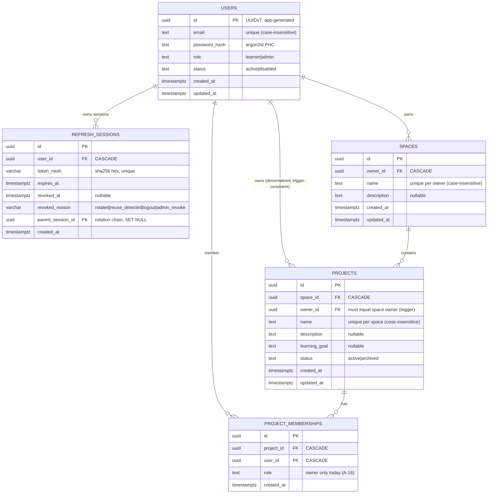

# Phase 1 ERD — Identity + Workspace

**Status:** Implemented. All relationships cascade from `users` (account deletion removes all learner data — retention requirement).

## Relationships, cardinality, and boundaries

| Relationship | Cardinality | Ownership semantics | Authorization boundary | RLS boundary |
|---|---|---|---|---|
| User → RefreshSession | 1 : 0..N | Session belongs to its user | Login path (future phase) reads by token hash | `user_id = app_user_id()` — no cross-user reads even via raw SQL |
| User → Space | 1 : 0..N | Space owned by exactly one user | Service layer: owner-scoped reads/writes only (404 on mismatch) | `owner_id = app_user_id()` |
| Space → Project | 1 : 0..N | Project lives inside one space; owner equality trigger-enforced | Space owner = project owner (single ownership chain) | `owner_id = app_user_id()` |
| User → ProjectMembership | 1 : 0..N | Membership row bound to user + project | Membership created only as part of project creation (service) | `user_id = app_user_id()` |
| Project → ProjectMembership | 1 : 0..N (1 owner today) | Exactly one `owner` membership (partial unique index) | A-16: single learner per project; collaboration deferred | Row-keyed; `has_project_access()` prepared for future (unused) |

## Project-isolation boundary

`projects.owner_id` is the isolation key for every later-phase table (materials, conversations, mastery, … will carry `project_id` and key their RLS policies on the same `app.current_user_id` / membership model). In Phase 1, owner-keying IS project-scoping because A-16 (single learner per project) makes membership ≡ ownership. The chain is enforced at three independent layers:

1. **Service/repo** — every read/write takes an explicit owner/user scope; no unscoped query surface exists.
2. **Trigger** — `projects.owner_id` cannot drift from `spaces.owner_id`.
3. **RLS** — even raw SQL through the application role sees only the context-bound user's rows (proven by isolation tests 3–6, including the filter-removed case).
