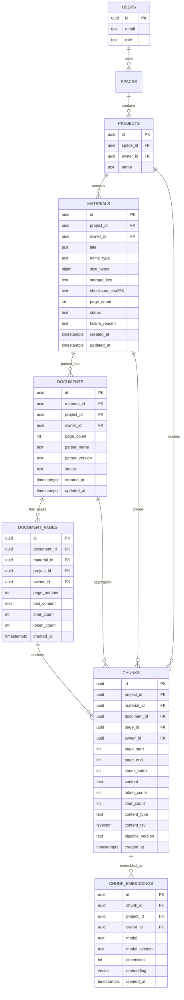

# Phase 3 Entity-Relationship Diagram

```mermaid
erDiagram
    USERS ||--o{ SPACES : owns
    SPACES ||--o{ PROJECTS : contains
    PROJECTS ||--o{ MATERIALS : contains
    MATERIALS ||--o{ DOCUMENTS : parsed_into
    DOCUMENTS ||--o{ DOCUMENT_PAGES : has_pages
    DOCUMENT_PAGES ||--o{ CHUNKS : anchors
    DOCUMENTS ||--o{ CHUNKS : aggregates
    MATERIALS ||--o{ CHUNKS : groups
    PROJECTS ||--o{ CHUNKS : isolates
    CHUNKS ||--o{ CHUNK_EMBEDDINGS : embedded_as

    USERS {
        uuid id PK
        text email
        text role
    }

    PROJECTS {
        uuid id PK
        uuid space_id FK
        uuid owner_id FK
        text name
    }

    MATERIALS {
        uuid id PK
        uuid project_id FK
        uuid owner_id FK
        text title
        text mime_type
        bigint size_bytes
        text storage_key
        text checksum_sha256
        int page_count
        text status
        text failure_reason
        timestamptz created_at
        timestamptz updated_at
    }

    DOCUMENTS {
        uuid id PK
        uuid material_id FK
        uuid project_id FK
        uuid owner_id FK
        int page_count
        text parser_name
        text parser_version
        text status
        timestamptz created_at
        timestamptz updated_at
    }

    DOCUMENT_PAGES {
        uuid id PK
        uuid document_id FK
        uuid material_id FK
        uuid project_id FK
        uuid owner_id FK
        int page_number
        text text_content
        int char_count
        int token_count
        timestamptz created_at
    }

    CHUNKS {
        uuid id PK
        uuid project_id FK
        uuid material_id FK
        uuid document_id FK
        uuid page_id FK
        uuid owner_id FK
        int page_start
        int page_end
        int chunk_index
        text content
        int token_count
        int char_count
        text content_type
        tsvector content_tsv
        text pipeline_version
        timestamptz created_at
    }

    CHUNK_EMBEDDINGS {
        uuid id PK
        uuid chunk_id FK
        uuid project_id FK
        uuid owner_id FK
        text model
        text model_version
        int dimension
        vector embedding
        timestamptz created_at
    }
```
